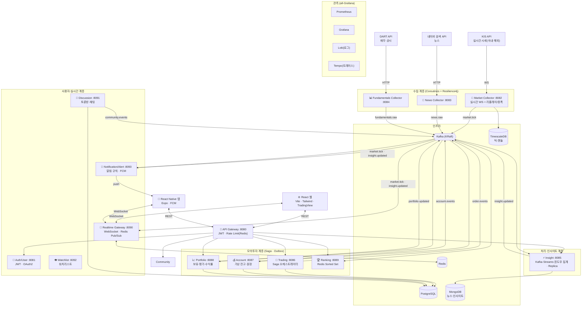

# StockPulse 시스템 아키텍처

> 확정 스택: Kotlin + Spring Boot MSA, Kafka(+**Kafka Streams**), Redis, PostgreSQL, **TimescaleDB**, MongoDB, **Coroutines**, K8s+HPA. 관측은 Prometheus + Grafana + **Loki + Tempo**. 클라이언트는 **React 웹 + React Native(Expo) 앱**, 푸시는 **FCM**.

---

## 1. 아키텍처 개요

- **MSA + 이벤트 기반(Event-Driven)**: 도메인별 독립 서비스, 서비스 간 결합은 Kafka 이벤트로 최소화.
- **동기/비동기 경계 원칙**:
  - **동기(REST)**: 즉시 응답이 필요한 조회/명령 (Gateway 경유). 예: 로그인, 시세 조회, 주문 접수, 워치리스트 관리.
  - **비동기(Kafka)**: 서비스 간 상태 전파, 스트림 처리, Saga 단계 전이. 예: 틱 스트림, 인사이트 산출, 주문 Saga.
  - **실시간(WebSocket)**: 서버→클라이언트 지속 푸시. 예: 실시간 시세, 채팅, 인사이트 갱신.
  - **푸시(FCM)**: 앱이 꺼져 있어도 전달되는 알림. 예: 목표가 도달, 뉴스 호재.
- **장애 격리**: 외부 API·다운스트림 장애가 전체로 번지지 않도록 Resilience4j(CB·retry·timeout·bulkhead) + Outbox(이벤트 무유실).

---

## 2. 전체 구성도

---

## 3. 서비스 목록과 책임 (14개)

| 서비스 | 포트 | 역할 | 핵심 기술 |
|--------|------|------|----------|
| API Gateway | 8080 | JWT 인증, Rate Limiting, 라우팅 | Spring Cloud Gateway, Redis |
| Auth/User | 8081 | 회원, JWT Access/Refresh, OAuth2, **워치리스트/관심종목** | Spring, PostgreSQL, Redis |
| Market Collector | 8082 | KIS 실시간 시세 수집(국내·해외), 리플레이/증폭 | Coroutines, Resilience4j, Kafka, TimescaleDB |
| News Collector | 8083 | 네이버 뉴스 주기 수집 | Coroutines, Resilience4j, Kafka |
| Fundamentals Collector | 8084 | DART 재무·공시 주기 수집 | Resilience4j, Kafka |
| Insight | 8085 | 4축(모멘텀·실적·밸류에이션·뉴스) 종합 → 전망 카드 + 백테스트 검증 | **Kafka Streams**, MongoDB, TimescaleDB |
| Trading | 8086 | 매수/매도 주문, Saga 오케스트레이션 | Saga, Outbox, PostgreSQL |
| Account | 8087 | 가상 잔고 예약·확정·해제, 원장 | Outbox, PostgreSQL |
| Portfolio | 8088 | 보유종목·평가금액·수익률 | Outbox, PostgreSQL |
| Ranking | 8089 | 수익률 랭킹 | Redis Sorted Set |
| Realtime Gateway | 8090 | 시세·채팅·인사이트 실시간 푸시 | WebSocket(STOMP), Redis Pub/Sub |
| Discussion (Community) | 8091 | 종목 토론방·게시글·댓글·실시간 채팅 | Outbox, PostgreSQL, Redis Pub/Sub |
| Watchlist | 8092 | 워치리스트 CRUD | PostgreSQL |
| Notification/Alert | 8093 | 알림 규칙(목표가 등) 평가, **FCM 푸시** | Kafka, FCM, PostgreSQL |

**클라이언트**: React 웹(TradingView 차트) · React Native(Expo) 앱(FCM 푸시 수신).

---

## 4. 통신 방식

| 방식 | 사용처 | 예시 |
|------|--------|------|
| 동기 REST (Gateway 경유) | 즉시 응답 필요한 조회/명령 | 로그인, 종목 조회, 주문 접수, 워치리스트 관리, 인사이트 카드 조회 |
| 비동기 Kafka | 서비스 간 상태 전파·스트림·Saga | 틱 스트림, 인사이트 산출, 주문 Saga 단계 전이 |
| 실시간 WebSocket | 서버→클라이언트 지속 푸시 | 실시간 시세, 종목 채팅, 인사이트 갱신 |
| 푸시 FCM | 앱 비활성 상태 알림 | 목표가 도달, 급등락, 뉴스 호재 |

---

## 5. Kafka 토픽 설계

| 토픽 | 발행자 | 구독자 | 파티션 키 | 용도 |
|------|--------|--------|----------|------|
| `market.tick` | Market Collector | Insight, Realtime Gateway, Notification, Trading(체결가) | 종목코드 | 실시간 시세 틱 |
| `news.raw` | News Collector | Insight | 종목코드 | 종목 뉴스 |
| `fundamentals.raw` | Fundamentals Collector | Insight | 종목코드 | 재무·공시 |
| `insight.updated` | Insight | Realtime Gateway, Notification | 종목코드 | 전망 카드 갱신 |
| `order.events` | Trading | Account | 주문ID | 주문 Saga 단계 이벤트 |
| `account.events` | Account | Trading(보상 응답), Portfolio | 사용자ID | 잔고 예약/확정/해제 |
| `portfolio.updated` | Portfolio | Trading(보상 응답), Ranking | 사용자ID | 보유·평가 변동 |
| `community.events` | Community | Notification | 종목코드 | 게시글·댓글 알림 트리거 |

> 파티션 키를 종목코드/사용자ID로 두어 같은 종목·같은 사용자 이벤트의 **순서 보장**을 확보한다.

---

## 6. 핵심 데이터 흐름

**① 실시간 시세**
KIS WS → Market Collector → `market.tick` → (Realtime Gateway → WebSocket 푸시) + (Notification → 알림 규칙 평가 → FCM) + (TimescaleDB 캔들 적재) + (Insight 윈도우 집계).

**② 인사이트 산출 (4축)**
Insight가 `market.tick`(모멘텀) + `fundamentals.raw`(실적·밸류에이션) + `news.raw`(감성)을 **Kafka Streams로 윈도우 집계·조인**하고, 밸류에이션은 업종 평균·과거 밴드(TimescaleDB) 대비 상대 위치로 계산 → 4축 종합 스코어 → MongoDB 저장 + `insight.updated` → Realtime Gateway 화면 갱신 + Notification 알림. 별도 주기 작업으로 **백테스트**(과거 점수 vs 이후 수익률)를 집계해 적중률 저장.

**③ 모의투자 Saga** (3개 서비스 분산 트랜잭션, 상세는 08_시퀀스다이어그램)
주문 접수(Trading) → `order.events` → 잔고 예약(Account) → 체결(Trading, `market.tick` 최근가) → 보유 갱신(Portfolio) → 확정+원장(Account) → `portfolio.updated` → Ranking 갱신. 각 단계 실패 시 보상 이벤트로 역순 롤백.

**④ 종목 채팅**
클라이언트 → Realtime Gateway(WS) → Redis Pub/Sub 발행 → 모든 Realtime Gateway 인스턴스 구독 → 연결된 클라이언트로 fan-out.

**⑤ 알림(FCM)**
Notification이 `market.tick`·`insight.updated`를 구독 → 사용자가 설정한 알림 규칙(목표가·급등락 등, 워치리스트 종목)과 매칭 → 충족 시 FCM으로 앱에 푸시.

---

## 7. 확장성 · 고가용성 설계

- **Insight Replica**: Kafka Streams 파티션 분산으로 수평 확장. 종목 수 증가에 대응.
- **Realtime Gateway 수평 확장**: WebSocket 세션은 인스턴스에 분산되지만 **Redis Pub/Sub fan-out**으로 어느 인스턴스에 붙어도 동일 메시지 수신 → 무중단·다중화.
- **K8s HPA**: CPU/커스텀 메트릭(WS 연결 수, 처리 지연) 기준 자동 스케일아웃 (Gateway·Realtime·Insight 대상).
- **Outbox + 멱등성**: Kafka 일시 장애에도 이벤트 무유실, 중복 소비 시 멱등 처리.
- **외부 의존 격리**: 수집기 CB가 열려도 캐시된 최근 시세/인사이트로 서비스 지속.

---

## 8. 배포 토폴로지 (K8s)

| Namespace | 구성 |
|-----------|------|
| `stockpulse-app` | 14개 애플리케이션 서비스 (React 웹은 별도 배포) |
| `stockpulse-infra` | Kafka, Redis, PostgreSQL, TimescaleDB, MongoDB |
| `stockpulse-monitor` | Prometheus, Grafana, Loki, Tempo |

- 서비스는 **Helm 차트**로 패키징, **GitHub Actions**로 빌드→테스트(Testcontainers)→이미지 푸시→배포.
- React Native 앱은 Expo로 빌드·배포(스토어 또는 Expo 채널), Gateway·Realtime·FCM과 통신.
- HPA는 `stockpulse-app`의 api-gateway·market-collector·trading-service에 적용 (CPU 70%, min 1 / max 3).
