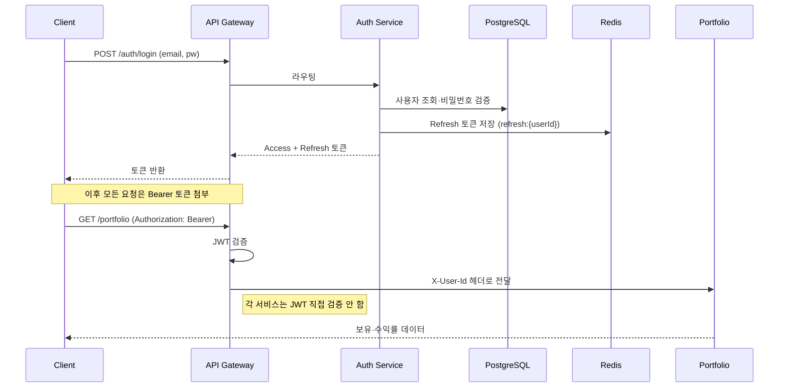
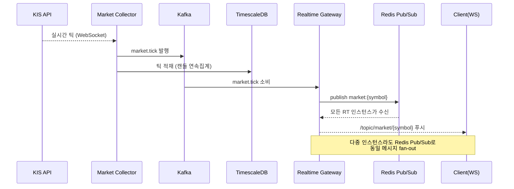
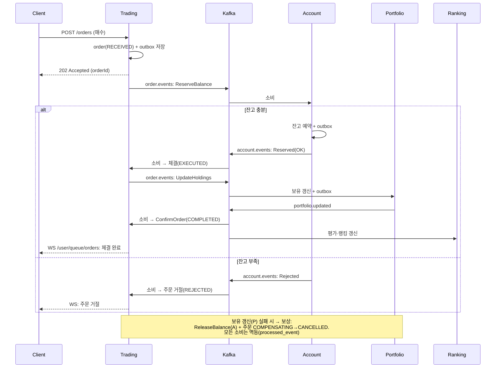
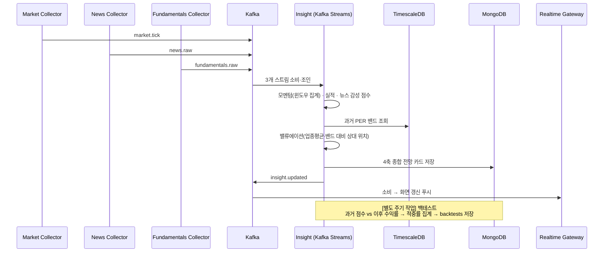

# StockPulse 시퀀스 다이어그램

> 주요 플로우의 시간순 상호작용. mermaid `sequenceDiagram`으로 표현(GitHub·VS Code에서 렌더). 읽는 법은 문서 하단 참고.

---

## 1. 로그인 + 인증된 요청 (Gateway 중앙 인증)

---

## 2. 실시간 시세 푸시

---

## 3. 모의투자 Saga (성공 + 보상)

---

## 4. 인사이트 4축 산출 + 백테스트

---

## 읽는 법 (시퀀스 다이어그램이란)

- **세로 = 시간**: 위에서 아래로 시간이 흐른다.
- **세로 점선(생명선)**: 각 참여자(서비스)가 살아있는 동안.
- **화살표**:
  - 실선 `->>` = 요청/메시지 보냄
  - 점선 `-->>` = 응답/비동기 전달
- **`alt / else`**: 조건 분기(성공/실패 등 경우의 수).
- **`Note`**: 부연 설명.

> 시퀀스 다이어그램은 "**여러 서비스가 시간 순서로 어떻게 주고받는지**"를 한눈에 보여준다. 특히 3번 Saga처럼 여러 서비스가 이벤트로 얽힌 흐름을 이해·검증할 때 가장 유용하다(어디서 실패하면 어떻게 보상하는지가 명확해짐).
